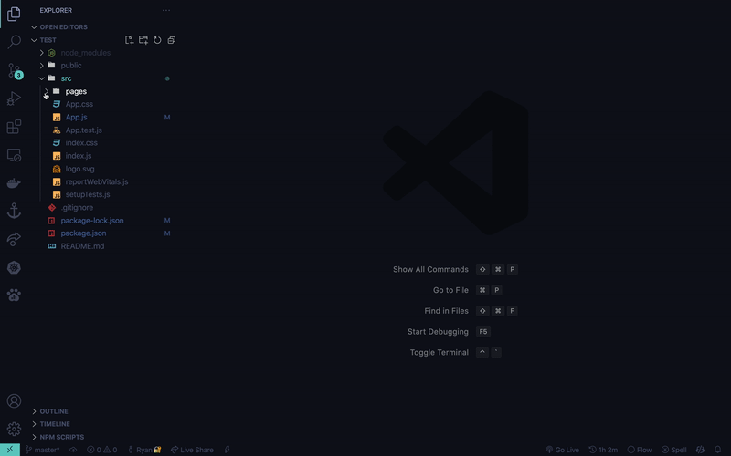

# react-component-generator README

## Features

Generates a folder and corresponding files for a React component.

## Requirements

This extension generates a Sass module file as the styling file - meaning your project will require sass (which you can install using `npm i sass`) 

## Extension Settings

No configurations at this time.

## Release Notes

### 1.0.0

Initial release of react-component-generator
